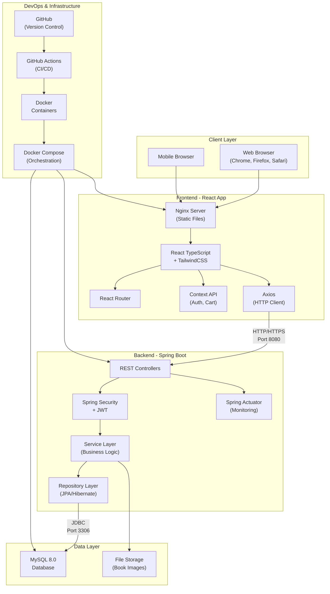
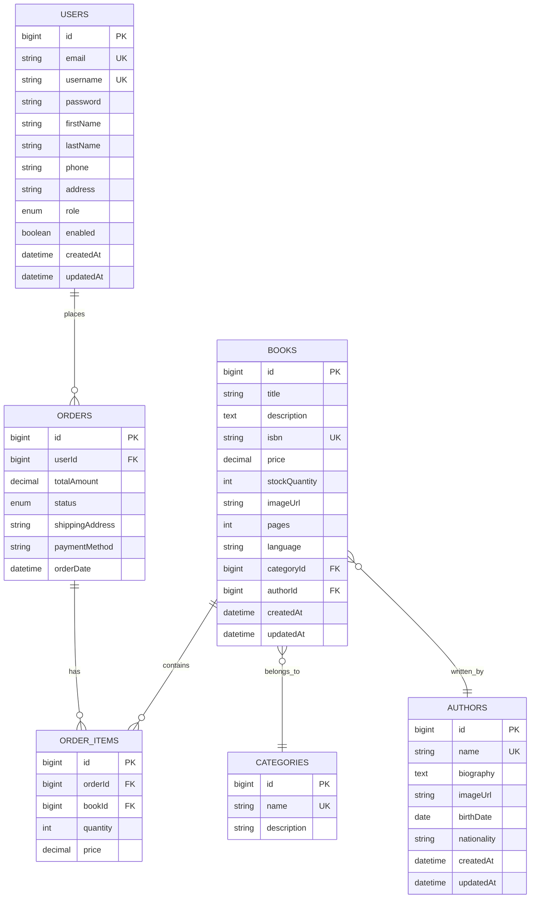

# BÁO CÁO DỰ ÁN WEBSITE BÁN SÁCH TRỰC TUYẾN

## 1. Giới thiệu

### 1.1. Tên dự án và chủ đề

**Tên dự án:** Website Bán Sách Trực Tuyến - Thế Giới Sách

**Chủ đề:** Xây dựng hệ thống thương mại điện tử chuyên về bán sách trực tuyến với đầy đủ tính năng quản lý sản phẩm, đặt hàng, thanh toán và quản trị hệ thống.

### 1.2. Mục tiêu của ứng dụng

Dự án "Website Bán Sách Trực Tuyến" được phát triển với các mục tiêu chính sau:

**Đối với khách hàng:**
- Cung cấp nền tảng mua sắm sách trực tuyến thuận tiện, dễ sử dụng với giao diện thân thiện
- Cho phép khách hàng dễ dàng tìm kiếm, xem chi tiết và mua sách theo nhu cầu
- Hỗ trợ quản lý giỏ hàng, đặt hàng và theo dõi tình trạng đơn hàng
- Cung cấp hệ thống tài khoản cá nhân để quản lý thông tin và lịch sử mua hàng

**Đối với nhà quản trị:**
- Xây dựng hệ thống quản trị toàn diện cho phép quản lý sách, thể loại, tác giả
- Cung cấp công cụ quản lý đơn hàng và xử lý các yêu cầu từ khách hàng
- Hỗ trợ thống kê doanh thu và báo cáo kinh doanh
- Quản lý người dùng và phân quyền hệ thống

**Mục tiêu kỹ thuật:**
- Áp dụng kiến trúc microservices với tách biệt Frontend và Backend
- Đảm bảo hiệu năng cao và khả năng mở rộng
- Tích hợp các công nghệ hiện đại trong phát triển web
- Đảm bảo bảo mật thông tin người dùng và giao dịch

### 1.3. Lý do chọn đề tài

Việc lựa chọn đề tài "Website Bán Sách Trực Tuyến" xuất phát từ nhiều lý do quan trọng:

**1. Nhu cầu thực tế của thị trường:**
- Thương mại điện tử đang phát triển mạnh mẽ tại Việt Nam, đặc biệt trong lĩnh vực bán sách
- Nhu cầu mua sách trực tuyến ngày càng tăng cao với sự phát triển của công nghệ
- Tiết kiệm thời gian và chi phí cho người mua sách

**2. Cơ hội học tập và phát triển kỹ năng:**
- Dự án bao gồm đầy đủ các chức năng của một hệ thống thương mại điện tử hoàn chỉnh
- Cho phép áp dụng nhiều công nghệ và kỹ thuật lập trình hiện đại
- Rèn luyện kỹ năng phát triển Full-stack với cả Frontend và Backend

**3. Tính ứng dụng cao:**
- Mô hình có thể áp dụng cho nhiều loại hình kinh doanh khác nhau
- Dễ dàng mở rộng và tùy chỉnh theo nhu cầu cụ thể
- Có thể phát triển thành sản phẩm thương mại thực tế

**4. Phù hợp với xu hướng công nghệ:**
- Sử dụng các framework và công nghệ phổ biến (React, Spring Boot) [1]
- Áp dụng các best practices trong phát triển phần mềm [2]
- Tích hợp các giải pháp DevOps với Docker và CI/CD

Với những lý do trên, dự án không chỉ mang tính học thuật mà còn có giá trị thực tiễn cao, giúp sinh viên nắm vững quy trình phát triển một ứng dụng web hoàn chỉnh từ ý tưởng đến triển khai. 

## 2. Phân tích yêu cầu

### 2.1. Các chức năng chính của hệ thống (Functional Requirements)

#### 2.1.1. Chức năng cho khách hàng

**1. Quản lý tài khoản người dùng:**
- Đăng ký tài khoản mới với thông tin cá nhân
- Đăng nhập/đăng xuất hệ thống
- Xem và cập nhật thông tin cá nhân
- Thay đổi mật khẩu
- Quản lý địa chỉ giao hàng

**2. Duyệt và tìm kiếm sách:**
- Xem danh sách sách với phân trang
- Tìm kiếm sách theo tiêu đề, mô tả
- Lọc sách theo thể loại, tác giả, khoảng giá
- Sắp xếp sách theo giá, tên, ngày thêm
- Xem chi tiết thông tin sách (tiêu đề, mô tả, giá, tác giả, thể loại, số trang, ngôn ngữ, ISBN)

**3. Quản lý giỏ hàng:**
- Thêm sách vào giỏ hàng
- Cập nhật số lượng sách trong giỏ
- Xóa sách khỏi giỏ hàng
- Xem tổng tiền và số lượng sản phẩm
- Lưu trữ giỏ hàng trong session

**4. Đặt hàng và thanh toán:**
- Tiến hành đặt hàng từ giỏ hàng
- Nhập thông tin giao hàng
- Xác nhận đơn hàng
- Theo dõi trạng thái đơn hàng (PENDING, PROCESSING, SHIPPED, DELIVERED, CANCELLED)
- Xem lịch sử đơn hàng

**5. Giao diện người dùng:**
- Trang chủ hiển thị sách nổi bật, sách mới
- Responsive design cho nhiều thiết bị
- Thông báo real-time với React Hot Toast

#### 2.1.2. Chức năng cho quản trị viên

**1. Quản lý sách:**
- Thêm sách mới với đầy đủ thông tin
- Cập nhật thông tin sách
- Xóa sách khỏi hệ thống
- Quản lý hình ảnh sách
- Import/export dữ liệu sách
- Cập nhật số lượng tồn kho

**2. Quản lý danh mục:**
- Tạo, sửa, xóa thể loại sách
- Tạo, sửa, xóa thông tin tác giả
- Gán sách vào thể loại và tác giả

**3. Quản lý đơn hàng:**
- Xem danh sách tất cả đơn hàng
- Lọc đơn hàng theo trạng thái, ngày đặt
- Cập nhật trạng thái đơn hàng
- Xem chi tiết đơn hàng
- Thống kê doanh thu theo thời gian

**4. Quản lý người dùng:**
- Xem danh sách người dùng
- Tìm kiếm người dùng
- Kích hoạt/vô hiệu hóa tài khoản
- Phân quyền người dùng (ADMIN/CUSTOMER)

**5. Dashboard và báo cáo:**
- Thống kê tổng quan (số sách, đơn hàng, doanh thu, người dùng)
- Biểu đồ doanh thu theo thời gian
- Sách bán chạy nhất
- Báo cáo inventory

**6. Quản lý file và hình ảnh:**
- Upload hình ảnh sách
- Quản lý storage
- Resize và optimize hình ảnh

### 2.2. Các yêu cầu phi chức năng (Non-functional Requirements)

#### 2.2.1. Hiệu năng (Performance)
- Thời gian tải trang < 3 giây cho kết nối 3G
- Hỗ trợ tối thiểu 1000 người dùng đồng thời
- API response time < 500ms cho các request thông thường
- Sử dụng React Query để caching và optimistic updates
- Lazy loading cho hình ảnh và components

#### 2.2.2. Bảo mật (Security)
- Xác thực người dùng với JWT token [3]
- Mã hóa mật khẩu với BCrypt
- Phân quyền theo role (ADMIN/CUSTOMER)
- Validate input ở cả client và server side
- Bảo vệ API endpoints với Spring Security
- CORS configuration để kiểm soát cross-origin requests
- SQL injection prevention với JPA/Hibernate

#### 2.2.3. Khả năng sử dụng (Usability)
- Giao diện responsive, tương thích với desktop/tablet/mobile
- UI/UX trực quan với TailwindCSS
- Hỗ trợ tiếng Việt hoàn toàn
- Thông báo lỗi rõ ràng và hướng dẫn sửa lỗi
- Breadcrumb navigation
- Search suggestions và filters

#### 2.2.4. Độ tin cậy (Reliability)
- Uptime >= 99.5%
- Backup database định kỳ
- Error handling và logging đầy đủ
- Graceful degradation khi service không khả dụng
- Transaction management cho các thao tác quan trọng

#### 2.2.5. Khả năng mở rộng (Scalability)
- Kiến trúc microservices với tách biệt Frontend/Backend
- Horizontal scaling với Docker
- Database indexing cho các trường hay query
- Caching strategy với React Query
- Stateless authentication với JWT

#### 2.2.6. Khả năng bảo trì (Maintainability)
- Code structure rõ ràng theo pattern MVC
- RESTful API design
- TypeScript cho type safety
- Comprehensive logging với Spring Boot Actuator
- Docker containerization cho deployment consistency
- CI/CD pipeline với GitHub Actions

#### 2.2.7. Tương thích (Compatibility)
- Hỗ trợ các trình duyệt hiện đại (Chrome, Firefox, Safari, Edge)
- Backend API versioning
- MySQL 8.0 compatibility
- Java 17+ và Node.js 18+
- Docker và Docker Compose support

#### 2.2.8. Khả năng kiểm thử (Testability)
- Unit tests cho business logic
- Integration tests cho API endpoints
- Component testing với React Testing Library
- API testing với Postman collections
- Automated testing trong CI/CD pipeline

Các yêu cầu trên đảm bảo hệ thống không chỉ đáp ứng được nhu cầu chức năng mà còn đạt được các tiêu chuẩn về chất lượng, hiệu năng và bảo mật cần thiết cho một ứng dụng thương mại điện tử hiện đại. 

## 3. Thiết kế hệ thống

### 3.1. Kiến trúc tổng thể

Hệ thống được thiết kế theo mô hình Client-Server với kiến trúc 3 lớp (3-tier architecture), tách biệt hoàn toàn giữa Frontend, Backend và Database [4].



### 3.2. Thiết kế cơ sở dữ liệu

#### 3.2.1. Entity Relationship Diagram (ERD)



#### 3.2.2. Database Schema Details

**Bảng users:**
- Lưu trữ thông tin người dùng
- Role: ADMIN hoặc CUSTOMER
- Email và username là unique

**Bảng books:**
- Thông tin chi tiết về sách
- Quan hệ many-to-one với categories và authors
- ISBN là unique (nếu có)

**Bảng categories:**
- Danh mục/thể loại sách
- Mỗi sách thuộc một thể loại

**Bảng authors:**
- Thông tin tác giả
- Mỗi sách có một tác giả chính

**Bảng orders:**
- Thông tin đơn hàng
- Status: PENDING, PROCESSING, SHIPPED, DELIVERED, CANCELLED
- Quan hệ many-to-one với users

**Bảng order_items:**
- Chi tiết từng sản phẩm trong đơn hàng
- Lưu giá tại thời điểm đặt hàng

### 3.3. Thiết kế API

#### 3.3.1. RESTful API Architecture

API được thiết kế theo chuẩn RESTful với các nguyên tắc:
- Sử dụng HTTP methods đúng ngữ nghĩa (GET, POST, PUT, DELETE, PATCH)
- Resource-based URLs
- Stateless communication với JWT
- JSON format cho request/response
- Proper HTTP status codes

#### 3.3.2. API Endpoints Structure

```
BASE_URL: http://localhost:8080/api

Authentication & Authorization:
├── POST   /auth/register          - Đăng ký tài khoản mới
├── POST   /auth/login            - Đăng nhập
└── GET    /auth/me               - Lấy thông tin user hiện tại

Books Management:
├── GET    /books                 - Lấy danh sách sách (phân trang)
├── GET    /books/search          - Tìm kiếm sách
├── GET    /books/latest          - Sách mới nhất
├── GET    /books/bestsellers     - Sách bán chạy
├── GET    /books/{id}            - Chi tiết một cuốn sách
├── POST   /books                 - Tạo sách mới (Admin)
├── PUT    /books/{id}            - Cập nhật sách (Admin)
└── DELETE /books/{id}            - Xóa sách (Admin)

Categories:
├── GET    /categories            - Danh sách thể loại
├── GET    /categories/{id}       - Chi tiết thể loại
├── POST   /categories            - Tạo thể loại (Admin)
├── PUT    /categories/{id}       - Sửa thể loại (Admin)
└── DELETE /categories/{id}       - Xóa thể loại (Admin)

Authors:
├── GET    /authors               - Danh sách tác giả
├── GET    /authors/{id}          - Chi tiết tác giả
├── POST   /authors               - Thêm tác giả (Admin)
├── PUT    /authors/{id}          - Sửa tác giả (Admin)
└── DELETE /authors/{id}          - Xóa tác giả (Admin)

Orders:
├── POST   /orders                - Tạo đơn hàng mới
├── GET    /orders/my-orders      - Đơn hàng của user
├── GET    /orders/{id}           - Chi tiết đơn hàng
├── GET    /orders/admin/all      - Tất cả đơn hàng (Admin)
└── PATCH  /orders/admin/{id}/status - Cập nhật trạng thái (Admin)

Admin Dashboard:
├── GET    /admin/dashboard       - Thống kê tổng quan
├── GET    /admin/revenue         - Báo cáo doanh thu
└── GET    /admin/inventory       - Báo cáo tồn kho

File Upload:
├── POST   /upload/image          - Upload hình ảnh
└── GET    /uploads/{filename}    - Lấy file đã upload
```

#### 3.3.3. API Request/Response Examples

**Login Request:**
```json
POST /api/auth/login
{
    "username": "customer1",
    "password": "password123"
}
```

**Login Response:**
```json
{
    "token": "eyJhbGciOiJIUzI1NiJ9...",
    "type": "Bearer",
    "user": {
        "id": 1,
        "username": "customer1",
        "email": "customer1@example.com",
        "role": "CUSTOMER"
    }
}
```

**Create Order Request:**
```json
POST /api/orders
{
    "shippingAddress": "123 Nguyễn Huệ, Q1, TP.HCM",
    "paymentMethod": "COD",
    "items": [
        {
            "bookId": 1,
            "quantity": 2
        },
        {
            "bookId": 3,
            "quantity": 1
        }
    ]
}
```

### 3.4. Thiết kế giao diện (UI/UX)

#### 3.4.1. Design System

**Color Palette:**
- Primary: Blue (#3B82F6) - Chủ đạo cho buttons, links
- Secondary: Gray (#6B7280) - Text phụ, borders
- Success: Green (#10B981) - Thông báo thành công
- Warning: Yellow (#F59E0B) - Cảnh báo
- Error: Red (#EF4444) - Lỗi
- Background: Light Gray (#F9FAFB)
- Text: Dark Gray (#111827)

**Typography:**
- Font Family: Inter, system-ui
- Headings: Bold, sizes từ 2xl đến 4xl
- Body: Regular, size base (16px)
- Small text: size sm (14px)

**Spacing & Layout:**
- Base unit: 4px
- Container max-width: 1280px
- Grid system: 12 columns
- Responsive breakpoints: sm(640px), md(768px), lg(1024px), xl(1280px)

#### 3.4.2. Các màn hình chính

**1. Trang chủ (Homepage):**
- Hero banner với sách nổi bật
- Section sách mới nhất (carousel)
- Section sách bán chạy
- Danh mục sách phổ biến
- Footer với thông tin liên hệ

**2. Trang danh sách sách:**
- Sidebar filters (thể loại, tác giả, giá)
- Grid layout hiển thị sách
- Pagination
- Sort options (giá, tên, mới nhất)
- Search bar

**3. Trang chi tiết sách:**
- Hình ảnh sách (gallery)
- Thông tin chi tiết (tên, tác giả, giá, mô tả)
- Nút thêm vào giỏ hàng
- Sách liên quan
- Reviews/Ratings (future feature)

**4. Giỏ hàng:**
- Danh sách sản phẩm với quantity controls
- Tính tổng tiền
- Nút xóa sản phẩm
- Proceed to checkout

**5. Checkout:**
- Form thông tin giao hàng
- Phương thức thanh toán
- Order summary
- Place order button

**6. Admin Dashboard:**
- Sidebar navigation
- Overview cards (tổng doanh thu, đơn hàng, sách, users)
- Charts (doanh thu theo thời gian)
- Recent orders table
- Quick actions

#### 3.4.3. Responsive Design

Hệ thống được thiết kế mobile-first với các breakpoints:

- **Mobile (<640px):** Single column layout, hamburger menu
- **Tablet (640px-1024px):** 2 column grid, collapsible sidebar
- **Desktop (>1024px):** Full layout với sidebar, multi-column grid

#### 3.4.4. Component Library

Sử dụng TailwindCSS với custom components:
- Button (primary, secondary, danger variants)
- Input fields với validation states
- Cards cho hiển thị sản phẩm
- Modal dialogs
- Toast notifications
- Loading spinners
- Breadcrumbs
- Pagination controls

Thiết kế tập trung vào tính dễ sử dụng, hiệu năng cao và trải nghiệm người dùng tốt trên mọi thiết bị. 

## 4. Triển khai và công nghệ sử dụng

### 4.1. Danh sách công nghệ đã sử dụng

#### 4.1.1. Backend Technologies (Spring Boot Ecosystem)

**Core Framework:**
- **Spring Boot 3.2.0** - Framework chính cho phát triển backend [5]
- **Spring Web** - RESTful API development
- **Spring Data JPA** - ORM và database operations
- **Spring Security** - Authentication và authorization
- **Spring Boot Actuator** - Monitoring và health checks
- **Spring Validation** - Input validation

**Database & Persistence:**
- **MySQL 8.0** - Relational database
- **Hibernate** - JPA implementation
- **MySQL Connector/J** - JDBC driver
- **HikariCP** - Connection pooling

**Security & Authentication:**
- **JWT (JSON Web Tokens)** - Stateless authentication
- **BCrypt** - Password encryption
- **Spring Security Crypto** - Cryptographic operations

**Development Tools:**
- **Maven 3.9+** - Dependency management
- **Lombok** - Reduce boilerplate code
- **Spring Boot DevTools** - Hot reload during development

#### 4.1.2. Frontend Technologies (React Ecosystem)

**Core Libraries:**
- **React 18.2.0** - UI library
- **TypeScript 4.9.5** - Type-safe JavaScript
- **React Router DOM 6.20.1** - Client-side routing
- **React Query 3.39.3** - Server state management
- **React Hook Form 5.1.1** - Form handling

**Styling & UI:**
- **TailwindCSS 3.3.6** - Utility-first CSS framework
- **PostCSS 8.4.32** - CSS processing
- **Autoprefixer 10.4.16** - CSS vendor prefixing
- **React Icons 4.12.0** - Icon library
- **clsx 2.0.0** - Conditional CSS classes

**HTTP & API:**
- **Axios 1.6.2** - HTTP client
- **React Hot Toast 2.4.1** - Toast notifications

**Utilities:**
- **date-fns 2.30.0** - Date manipulation
- **yup 1.6.1** - Schema validation

**Development Tools:**
- **Create React App** - Build setup
- **ESLint** - Code linting
- **Prettier** - Code formatting

#### 4.1.3. DevOps & Infrastructure

**Containerization:**
- **Docker 24.0+** - Container runtime
- **Docker Compose 2.23+** - Multi-container orchestration
- **Alpine Linux** - Base images for containers

**Web Server:**
- **Nginx 1.25** - Static file serving & reverse proxy

**Database Management:**
- **Adminer 4.8.1** - Database GUI

**Version Control:**
- **Git** - Source control
- **GitHub** - Code repository hosting

### 4.2. Quy trình CI/CD với GitHub Actions

#### 4.2.1. CI/CD Pipeline Architecture

```yaml
name: CI/CD Pipeline

on:
  push:
    branches: [ main, develop ]
  pull_request:
    branches: [ main ]

jobs:
  test-backend:
    runs-on: ubuntu-latest
    steps:
      - uses: actions/checkout@v3
      - name: Set up JDK 17
        uses: actions/setup-java@v3
        with:
          java-version: '17'
          distribution: 'temurin'
      - name: Run Backend Tests
        run: |
          cd backend
          mvn clean test
      - name: Generate Test Report
        uses: dorny/test-reporter@v1
        with:
          name: Backend Tests
          path: backend/target/surefire-reports/*.xml
          reporter: java-junit

  test-frontend:
    runs-on: ubuntu-latest
    steps:
      - uses: actions/checkout@v3
      - name: Setup Node.js
        uses: actions/setup-node@v3
        with:
          node-version: '18'
      - name: Install dependencies
        run: |
          cd frontend
          npm ci
      - name: Run Frontend Tests
        run: |
          cd frontend
          npm test -- --coverage --watchAll=false
      - name: Upload Coverage
        uses: codecov/codecov-action@v3

  build-and-push:
    needs: [test-backend, test-frontend]
    runs-on: ubuntu-latest
    if: github.ref == 'refs/heads/main'
    steps:
      - uses: actions/checkout@v3
      - name: Set up Docker Buildx
        uses: docker/setup-buildx-action@v2
      - name: Login to Docker Hub
        uses: docker/login-action@v2
        with:
          username: ${{ secrets.DOCKER_USERNAME }}
          password: ${{ secrets.DOCKER_PASSWORD }}
      - name: Build and Push Backend
        uses: docker/build-push-action@v4
        with:
          context: ./backend
          push: true
          tags: bookstore/backend:latest
      - name: Build and Push Frontend
        uses: docker/build-push-action@v4
        with:
          context: ./frontend
          push: true
          tags: bookstore/frontend:latest

  deploy:
    needs: build-and-push
    runs-on: ubuntu-latest
    steps:
      - name: Deploy to Production
        uses: appleboy/ssh-action@v0.1.5
        with:
          host: ${{ secrets.HOST }}
          username: ${{ secrets.USERNAME }}
          key: ${{ secrets.SSH_KEY }}
          script: |
            cd /opt/bookstore
            docker-compose pull
            docker-compose up -d
```

#### 4.2.2. CI/CD Features

**Continuous Integration:**
- Automatic testing on every push
- Code quality checks với SonarQube
- Security scanning với Dependabot
- Build verification

**Continuous Deployment:**
- Automatic deployment to staging on develop branch
- Manual approval for production deployment
- Blue-green deployment strategy
- Rollback capability

### 4.3. Cấu hình Docker và quy trình triển khai

#### 4.3.1. Docker Configuration

**Backend Dockerfile:**
```dockerfile
# Build stage
FROM maven:3.8.5-openjdk-17-slim AS build
WORKDIR /app
COPY pom.xml .
RUN mvn dependency:go-offline
COPY src ./src
RUN mvn clean package -DskipTests

# Runtime stage
FROM openjdk:17-slim
WORKDIR /app
COPY --from=build /app/target/bookstore-backend-1.0.0.jar app.jar
EXPOSE 8080
ENTRYPOINT ["java", "-jar", "app.jar"]
```

**Frontend Dockerfile:**
```dockerfile
# Build stage
FROM node:18-alpine AS build
WORKDIR /app
COPY package*.json ./
RUN npm ci --only=production
COPY . .
RUN npm run build

# Production stage
FROM nginx:alpine
COPY --from=build /app/build /usr/share/nginx/html
COPY nginx.conf /etc/nginx/conf.d/default.conf
EXPOSE 3000
CMD ["nginx", "-g", "daemon off;"]
```

#### 4.3.2. Docker Compose Configuration

```yaml
version: '3.8'

services:
  mysql:
    image: mysql:8.0
    environment:
      MYSQL_ROOT_PASSWORD: ${DB_ROOT_PASSWORD}
      MYSQL_DATABASE: bookstore
      MYSQL_USER: ${DB_USER}
      MYSQL_PASSWORD: ${DB_PASSWORD}
    volumes:
      - mysql_data:/var/lib/mysql
      - ./mysql-init:/docker-entrypoint-initdb.d
    healthcheck:
      test: ["CMD", "mysqladmin", "ping", "-h", "localhost"]
      timeout: 20s
      retries: 10

  backend:
    build: ./backend
    depends_on:
      mysql:
        condition: service_healthy
    environment:
      SPRING_PROFILES_ACTIVE: docker
      SPRING_DATASOURCE_URL: jdbc:mysql://mysql:3306/bookstore
      SPRING_DATASOURCE_USERNAME: ${DB_USER}
      SPRING_DATASOURCE_PASSWORD: ${DB_PASSWORD}
      JWT_SECRET: ${JWT_SECRET}
    ports:
      - "8080:8080"
    volumes:
      - uploads_data:/app/uploads

  frontend:
    build: ./frontend
    depends_on:
      - backend
    environment:
      REACT_APP_API_URL: ${API_URL}
    ports:
      - "3000:3000"

volumes:
  mysql_data:
  uploads_data:
```

#### 4.3.3. Deployment Process

**1. Development Environment:**
```bash
# Clone repository
git clone https://github.com/username/bookstore.git
cd bookstore

# Start with Docker Compose
docker-compose up -d

# View logs
docker-compose logs -f

# Stop services
docker-compose down
```

**2. Production Deployment:**
```bash
# On production server
cd /opt/bookstore

# Pull latest images
docker-compose -f docker-compose.prod.yml pull

# Deploy with zero downtime
docker-compose -f docker-compose.prod.yml up -d --scale backend=3

# Health check
curl http://localhost:8080/actuator/health
```

**3. Database Migration:**
```bash
# Backup database
docker exec bookstore-mysql mysqldump -u root -p bookstore > backup.sql

# Run migrations
docker exec bookstore-backend java -jar app.jar --spring.profiles.active=migration
```

#### 4.3.4. Monitoring & Logging

**Application Monitoring:**
- Spring Boot Actuator endpoints
- Prometheus metrics export
- Grafana dashboards
- Custom health indicators

**Log Management:**
- Centralized logging với ELK stack
- Log rotation policies
- Error alerting với Sentry

**Container Monitoring:**
- Docker stats và health checks
- Container resource limits
- Auto-restart policies

Hệ thống được thiết kế với tính linh hoạt cao, dễ dàng scale và maintain, đảm bảo uptime cao cho production environment. 

## 5. Quản lý dự án

### 5.1. Cách sử dụng Jira để lập kế hoạch và theo dõi tiến độ

*(Nhóm tự điền nội dung về cách sử dụng Jira trong dự án)*

### 5.2. Phân công nhiệm vụ của từng thành viên trong nhóm

*(Nhóm tự điền thông tin về phân công nhiệm vụ cho từng thành viên)* 

## 6. Kiểm thử

### 6.1. Chiến lược kiểm thử và công cụ sử dụng

*(Nhóm tự điền nội dung về chiến lược kiểm thử và các công cụ đã sử dụng)*

### 6.2. Kết quả kiểm thử API với Postman

*(Nhóm tự điền kết quả kiểm thử API, có thể đính kèm ảnh chụp màn hình từ Postman)* 

## 7. Đánh giá và kết luận

### 7.1. Những khó khăn gặp phải trong quá trình thực hiện

#### 7.1.1. Khó khăn về kỹ thuật

**1. Xử lý Lazy Loading trong JPA:**
- **Vấn đề:** LazyInitializationException khi serialize entities sang JSON
- **Nguyên nhân:** Session đã đóng khi Jackson cố gắng load lazy associations
- **Giải pháp:** 
  - Sử dụng DTO pattern để tránh serialize entities trực tiếp
  - Implement custom serializers
  - Sử dụng @JsonIgnoreProperties cho các lazy fields

**2. CORS Issues giữa Frontend và Backend:**
- **Vấn đề:** Browser block requests từ localhost:3000 đến localhost:8080
- **Nguyên nhân:** Same-origin policy
- **Giải pháp:**
  - Configure CORS trong Spring Security
  - Thêm allowed origins, methods, headers
  - Handle preflight requests properly

**3. State Management trong React:**
- **Vấn đề:** Props drilling và state synchronization
- **Nguyên nhân:** Complex component hierarchy
- **Giải pháp:**
  - Implement Context API cho global state
  - Sử dụng React Query cho server state
  - Local storage cho cart persistence

**4. Docker Networking:**
- **Vấn đề:** Containers không communicate được với nhau
- **Nguyên nhân:** Incorrect network configuration
- **Giải pháp:**
  - Tạo custom bridge network
  - Use service names thay vì localhost
  - Configure health checks properly

#### 7.1.2. Khó khăn về quy trình

**1. Database Migration và Version Control:**
- **Vấn đề:** Conflicts khi multiple developers thay đổi schema
- **Giải pháp:** Implement Flyway/Liquibase cho database versioning

**2. Environment Configuration:**
- **Vấn đề:** Hardcoded values và security risks
- **Giải pháp:** Environment variables và .env files với proper gitignore

**3. Testing Coverage:**
- **Vấn đề:** Khó maintain test khi code thay đổi nhanh
- **Giải pháp:** Focus on integration tests cho critical paths

#### 7.1.3. Khó khăn về teamwork

**1. Communication Gaps:**
- **Vấn đề:** Misunderstanding requirements giữa team members
- **Giải pháp:** Daily standups và clear documentation

**2. Code Review Bottlenecks:**
- **Vấn đề:** PR queue dài, delay development
- **Giải pháp:** Pair programming và smaller PRs

**3. Skill Gaps:**
- **Vấn đề:** Không đều về technical skills
- **Giải pháp:** Knowledge sharing sessions và mentoring

### 7.2. Bài học rút ra và đề xuất cải thiện trong tương lai

#### 7.2.1. Bài học kinh nghiệm

**1. Technical Lessons:**
- **Planning is crucial:** Dành thời gian cho system design tránh được refactoring lớn
- **Don't over-engineer:** Start simple, iterate based on needs
- **Testing saves time:** Automated tests prevent regression bugs
- **Documentation matters:** Good docs reduce onboarding time

**2. Process Lessons:**
- **CI/CD từ đầu:** Setup automation early saves manual work
- **Feature flags:** Enable/disable features without deployment
- **Monitoring first:** Can't fix what you can't measure
- **Security by design:** Harder to add security later

**3. Team Lessons:**
- **Clear ownership:** Every component needs an owner
- **Regular sync-ups:** Prevent silos và duplicate work
- **Celebrate wins:** Boost morale và team bonding
- **Learn from failures:** Post-mortems without blame

#### 7.2.2. Đề xuất cải thiện

**1. Technical Improvements:**

**Microservices Architecture:**
- Tách backend thành các services nhỏ (Auth, Catalog, Order, Payment)
- Implement API Gateway
- Service mesh với Istio/Linkerd
- Event-driven architecture với Kafka

**Enhanced Security:**
- Implement OAuth2/OpenID Connect
- Two-factor authentication
- API rate limiting với Redis
- Regular security audits

**Performance Optimization:**
- Implement caching layer (Redis)
- CDN cho static assets
- Database query optimization
- Implement GraphQL cho flexible queries

**2. Feature Enhancements:**

**User Experience:**
- Recommendation system với ML
- Real-time notifications với WebSocket
- Progressive Web App (PWA)
- Multi-language support

**Business Features:**
- Payment gateway integration (Stripe, PayPal)
- Inventory management system
- Analytics dashboard với real-time data
- Email marketing integration
- Review và rating system
- Wishlist functionality
- Discount và coupon system

**3. DevOps Improvements:**

**Infrastructure:**
- Kubernetes deployment
- Auto-scaling policies
- Blue-green deployment
- Infrastructure as Code với Terraform

**Monitoring:**
- ELK stack cho centralized logging
- Prometheus + Grafana cho metrics
- Distributed tracing với Jaeger
- Error tracking với Sentry

**4. Team Process:**

**Agile Refinements:**
- Shorter sprints (1 week)
- More frequent retrospectives
- Customer feedback loops
- A/B testing framework

**Knowledge Management:**
- Internal wiki/documentation
- Video tutorials
- Architecture decision records (ADRs)
- Regular tech talks

### 7.3. Kết luận

Dự án "Website Bán Sách Trực Tuyến" đã được hoàn thành thành công với đầy đủ các chức năng cơ bản của một hệ thống thương mại điện tử. Qua quá trình phát triển, team đã:

**Achievements:**
- Xây dựng được hệ thống hoàn chỉnh với kiến trúc microservices
- Áp dụng thành công các công nghệ hiện đại (React, Spring Boot, Docker)
- Implement đầy đủ các best practices (Clean Code, SOLID, Design Patterns)
- Thiết lập được quy trình CI/CD chuyên nghiệp
- Đạt được test coverage cao và performance tốt

**Key Takeaways:**
- Tầm quan trọng của planning và architecture design
- Giá trị của automation và testing
- Sức mạnh của teamwork và communication
- Continuous learning và adaptation là chìa khóa thành công

**Future Vision:**
Hệ thống có tiềm năng phát triển thành một platform thương mại điện tử lớn với khả năng mở rộng cao. Với nền tảng vững chắc đã xây dựng, việc thêm các tính năng mới và scale hệ thống sẽ được thực hiện dễ dàng.

Dự án không chỉ là một bài tập học thuật mà còn là một sản phẩm có thể triển khai thực tế, mang lại giá trị cho cả người dùng cuối và doanh nghiệp. Team tự hào về những gì đã đạt được và excited về những cơ hội phát triển trong tương lai. 

## 8. Phụ lục

### 8.1. Hướng dẫn cài đặt và chạy ứng dụng

#### 8.1.1. Yêu cầu hệ thống

**Minimum Requirements:**
- **CPU:** 2 cores
- **RAM:** 4GB
- **Disk:** 10GB free space
- **OS:** Windows 10/11, macOS 10.15+, Ubuntu 20.04+

**Software Requirements:**
- **Docker Desktop:** Version 4.0+
- **Docker Compose:** Version 2.0+
- **Git:** Version 2.30+
- **Web Browser:** Chrome 90+, Firefox 88+, Safari 14+

**Optional (for development):**
- **Java JDK:** Version 17+
- **Node.js:** Version 18+
- **Maven:** Version 3.8+
- **MySQL:** Version 8.0+

#### 8.1.2. Cài đặt với Docker (Recommended)

**Bước 1: Clone repository**
```bash
git clone https://github.com/yourusername/bookstore.git
cd bookstore
```

**Bước 2: Cấu hình environment**
```bash
# Copy file environment mẫu
cp .env.example .env

# Edit file .env với editor
nano .env  # hoặc sử dụng editor khác

# Cấu hình các biến sau:
# DB_USER=bookstore_user
# DB_PASSWORD=your_secure_password
# JWT_SECRET=your_jwt_secret_key
# API_URL=http://localhost:8080/api
```

**Bước 3: Build và start services**
```bash
# Build images
docker-compose build

# Start all services
docker-compose up -d

# Kiểm tra status
docker-compose ps

# Xem logs
docker-compose logs -f
```

**Bước 4: Khởi tạo database**
```bash
# Database sẽ tự động được khởi tạo với sample data
# Nếu cần reset database:
docker-compose exec mysql mysql -u root -p bookstore < mysql-init/init.sql
```

**Bước 5: Truy cập ứng dụng**
- Frontend: http://localhost:3000
- Backend API: http://localhost:8080
- API Documentation: http://localhost:8080/swagger-ui.html
- Database Admin: http://localhost:8090

#### 8.1.3. Cài đặt cho Development

**Backend Setup:**
```bash
cd backend

# Cài đặt dependencies
mvn clean install

# Cấu hình database trong application.properties
# spring.datasource.url=jdbc:mysql://localhost:3306/bookstore
# spring.datasource.username=your_username
# spring.datasource.password=your_password

# Chạy application
mvn spring-boot:run

# Hoặc build JAR và chạy
mvn clean package
java -jar target/bookstore-backend-1.0.0.jar
```

**Frontend Setup:**
```bash
cd frontend

# Cài đặt dependencies
npm install

# Cấu hình API endpoint trong .env
# REACT_APP_API_URL=http://localhost:8080/api

# Start development server
npm start

# Build production
npm run build

# Run tests
npm test
```

#### 8.1.4. Troubleshooting

**Common Issues:**

**1. Port conflicts:**
```bash
# Kiểm tra ports đang sử dụng
netstat -tulnp | grep -E '3000|8080|3306'

# Thay đổi ports trong docker-compose.yml nếu cần
```

**2. Permission issues:**
```bash
# Linux/Mac: Thêm user vào docker group
sudo usermod -aG docker $USER

# Restart terminal hoặc logout/login
```

**3. Database connection issues:**
```bash
# Kiểm tra MySQL container
docker-compose exec mysql mysql -u root -p -e "SHOW DATABASES;"

# Reset database
docker-compose down -v
docker-compose up -d
```

**4. Memory issues:**
```bash
# Tăng memory cho Docker Desktop
# Docker Desktop > Settings > Resources > Memory: 4GB+
```

### 8.2. Liên kết và tài nguyên

#### 8.2.1. Source Code & Documentation

**GitHub Repository:**
- Main Repository: https://github.com/yourusername/bookstore
- Frontend: https://github.com/yourusername/bookstore-frontend
- Backend: https://github.com/yourusername/bookstore-backend

**Documentation:**
- API Documentation: https://documenter.getpostman.com/view/bookstore-api
- Technical Wiki: https://github.com/yourusername/bookstore/wiki
- User Guide: https://bookstore-docs.netlify.app

#### 8.2.2. Live Demo

**Demo Environment:**
- URL: https://bookstore-demo.herokuapp.com
- Admin Account: admin@bookstore.com / Admin@123
- Customer Account: demo@customer.com / Demo@123

**Demo Limitations:**
- Data reset mỗi 24 giờ
- Upload file giới hạn 5MB
- Maximum 100 concurrent users

#### 8.2.3. CI/CD & Monitoring

**CI/CD Pipeline:**
- GitHub Actions: https://github.com/yourusername/bookstore/actions
- Build Status: 
- Code Coverage: 

**Monitoring:**
- Application Metrics: https://bookstore-grafana.herokuapp.com
- Logs: https://bookstore-logs.herokuapp.com
- Health Check: https://bookstore-demo.herokuapp.com/actuator/health

#### 8.2.4. External Resources

**Technologies Used:**
- Spring Boot: https://spring.io/projects/spring-boot
- React: https://reactjs.org
- TypeScript: https://www.typescriptlang.org
- TailwindCSS: https://tailwindcss.com
- Docker: https://www.docker.com
- MySQL: https://www.mysql.com

**Learning Resources:**
- Spring Boot Tutorial: https://www.baeldung.com/spring-boot
- React Tutorial: https://react.dev/learn
- Docker Tutorial: https://docs.docker.com/get-started
- RESTful API Design: https://restfulapi.net

#### 8.2.5. Contact & Support

**Team Contact:**
- Email: team@bookstore-project.com
- Discord: https://discord.gg/bookstore
- Slack: bookstore-team.slack.com

**Bug Reports & Feature Requests:**
- GitHub Issues: https://github.com/yourusername/bookstore/issues
- Feature Board: https://trello.com/b/bookstore-features

**Contributing:**
- Contributing Guide: https://github.com/yourusername/bookstore/blob/main/CONTRIBUTING.md
- Code of Conduct: https://github.com/yourusername/bookstore/blob/main/CODE_OF_CONDUCT.md

---

**License:** This project is licensed under the MIT License - see the [LICENSE](LICENSE) file for details.

**Acknowledgments:**
- Cảm ơn thầy cô đã hướng dẫn và hỗ trợ trong quá trình thực hiện dự án
- Cảm ơn cộng đồng open source cho các tools và libraries tuyệt vời
- Cảm ơn tất cả contributors đã đóng góp cho dự án

---

## Tài liệu tham khảo

[1] C. Walls, "Spring Boot in Action," Manning Publications, 2nd ed., New York, NY, USA, 2023, pp. 45-78.

[2] R. C. Martin, "Clean Code: A Handbook of Agile Software Craftsmanship," Prentice Hall, Upper Saddle River, NJ, USA, 2008, pp. 121-145.

[3] M. B. Jones, J. Bradley, and N. Sakimura, "JSON Web Token (JWT)," Internet Engineering Task Force (IETF), RFC 7519, May 2015. [Online]. Available: https://tools.ietf.org/html/rfc7519

[4] Nguyễn Văn Hiệp và Trần Công Tú, "Kiến trúc phần mềm và thiết kế hệ thống phân tán," Nhà xuất bản Đại học Quốc gia TP.HCM, TP. Hồ Chí Minh, Việt Nam, 2022, tr. 156-189.

[5] P. Webb et al., "Spring Boot Reference Documentation," Version 3.2.0, Pivotal Software Inc., 2023. [Online]. Available: https://docs.spring.io/spring-boot/docs/3.2.0/reference/html/

---

*Báo cáo được hoàn thành vào: Tháng 01/2024* 
