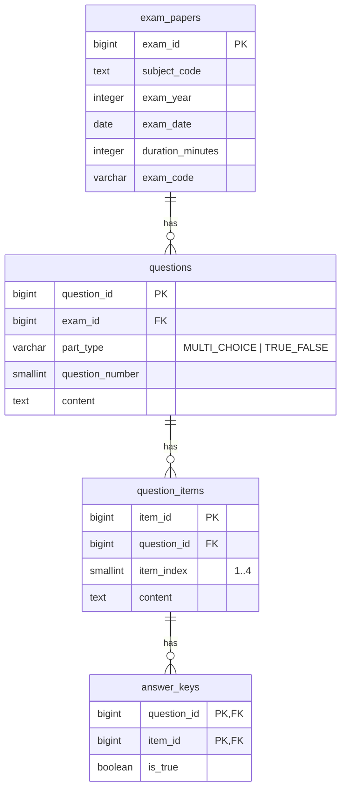

## Thiết kế CSDL rút gọn cho hệ thống đề thi trắc nghiệm Tin học THPT Quốc gia

### 1) Mô tả ERD (bằng văn bản)
Lược đồ tối giản còn 4 bảng, vẫn tách đáp án ra bảng riêng:
- **exam_papers**: Thông tin một đề thi (môn, năm, ngày, thời lượng, mã đề). Dùng `subject_code` dạng text để giảm số bảng, vẫn đảm bảo mở rộng nhiều môn.
- **questions**: Câu hỏi thuộc một đề, có `part_type` để phân biệt Phần I (MULTI_CHOICE) và Phần II (TRUE_FALSE), `question_number` đánh số trong từng phần.
- **question_items**: 4 mục con của mỗi câu hỏi.
  - Nếu `part_type = MULTI_CHOICE`: 4 lựa chọn, dùng `item_index` 1..4 (tương ứng A..D) và `content` là nội dung phương án.
  - Nếu `part_type = TRUE_FALSE`: 4 ý nhỏ (ý 1..4), `item_index` 1..4 và `content` là nội dung ý.
- **answer_keys**: Bảng đáp án riêng.
  - Với MCQ: lưu 1 hàng chỉ ra mục đúng (item_index/chính xác là `item_id`).
  - Với TRUE_FALSE: lưu 4 hàng (mỗi ý một hàng) với `is_true` là Đúng/Sai.

Ràng buộc và tối ưu:
- Khóa ngoại `questions.exam_id → exam_papers.exam_id` (ON DELETE CASCADE).
- Khóa ngoại `question_items.question_id → questions.question_id` (ON DELETE CASCADE).
- Khóa ngoại kép trong `answer_keys (question_id, item_id)` tham chiếu `question_items (question_id, item_id)` để đảm bảo đáp án thuộc đúng câu.
- Duy nhất:
  - `(subject_code, exam_year, exam_code)` trong `exam_papers`.
  - `(exam_id, part_type, question_number)` trong `questions` để đánh số lại theo phần.
  - `(question_id, item_index)` trong `question_items` đảm bảo đúng 4 mục 1..4.
- CHECK:
  - `part_type IN ('MULTI_CHOICE','TRUE_FALSE')`.
  - `item_index BETWEEN 1 AND 4`.
  - Nên bổ sung trigger ở DB hoặc ràng buộc ở ứng dụng để đảm bảo: MCQ có đúng 4 item và đúng 1 đáp án; TRUE_FALSE có đúng 4 item và đủ 4 dòng đáp án (true/false).

### 2) Sơ đồ ERD (Mermaid)


### 3) Lệnh SQL tạo bảng (PostgreSQL)
```sql
BEGIN;

CREATE TABLE IF NOT EXISTS exam_papers (
    exam_id          BIGINT GENERATED ALWAYS AS IDENTITY PRIMARY KEY,
    subject_code     TEXT       NOT NULL,               -- ví dụ: 'TIN', 'TOAN'
    exam_year        INTEGER    NOT NULL CHECK (exam_year BETWEEN 2000 AND 2100),
    exam_date        DATE       NOT NULL,
    duration_minutes INTEGER    NOT NULL CHECK (duration_minutes BETWEEN 1 AND 300),
    exam_code        VARCHAR(20) NOT NULL,
    CONSTRAINT uq_exam_per_subject_year_code UNIQUE (subject_code, exam_year, exam_code)
);

CREATE TABLE IF NOT EXISTS questions (
    question_id      BIGINT GENERATED ALWAYS AS IDENTITY PRIMARY KEY,
    exam_id          BIGINT    NOT NULL REFERENCES exam_papers(exam_id)
                                   ON UPDATE CASCADE ON DELETE CASCADE,
    part_type        VARCHAR(20) NOT NULL CHECK (part_type IN ('MULTI_CHOICE','TRUE_FALSE')),
    question_number  SMALLINT  NOT NULL CHECK (question_number >= 1),
    content          TEXT      NOT NULL,
    CONSTRAINT uq_question_number_per_part UNIQUE (exam_id, part_type, question_number)
);

CREATE INDEX IF NOT EXISTS idx_questions_exam_part ON questions(exam_id, part_type);

CREATE TABLE IF NOT EXISTS question_items (
    item_id       BIGINT GENERATED ALWAYS AS IDENTITY PRIMARY KEY,
    question_id   BIGINT    NOT NULL REFERENCES questions(question_id)
                                ON UPDATE CASCADE ON DELETE CASCADE,
    item_index    SMALLINT  NOT NULL CHECK (item_index BETWEEN 1 AND 4),
    content       TEXT      NOT NULL,
    CONSTRAINT uq_item_index_per_question UNIQUE (question_id, item_index),
    -- Tạo unique pair để phục vụ FK kép từ answer_keys
    CONSTRAINT uq_item_per_question UNIQUE (question_id, item_id)
);

CREATE INDEX IF NOT EXISTS idx_items_question ON question_items(question_id);

CREATE TABLE IF NOT EXISTS answer_keys (
    question_id  BIGINT   NOT NULL,
    item_id      BIGINT   NOT NULL,
    is_true      BOOLEAN  NOT NULL,
    PRIMARY KEY (question_id, item_id),
    CONSTRAINT fk_answer_pair FOREIGN KEY (question_id, item_id)
        REFERENCES question_items (question_id, item_id)
        ON UPDATE CASCADE ON DELETE CASCADE
);

COMMIT;
```

### 4) Prompt tạo entity JPA (Spring Boot)
Dán nguyên khối prompt sau vào công cụ sinh mã (hoặc ChatGPT) để tạo entity, enum và repository theo đúng lược đồ trên:

```
Bạn là chuyên gia Spring Boot + JPA (Jakarta) với Java 17.
Hãy sinh mã entity, enum và repository cho lược đồ PostgreSQL sau (4 bảng) với yêu cầu chi tiết:

-- Lược đồ
- exam_papers(exam_id PK, subject_code TEXT NOT NULL, exam_year INT, exam_date DATE, duration_minutes INT, exam_code VARCHAR(20), UNIQUE(subject_code, exam_year, exam_code))
- questions(question_id PK, exam_id FK→exam_papers.exam_id, part_type VARCHAR(20) IN('MULTI_CHOICE','TRUE_FALSE'), question_number SMALLINT ≥1, content TEXT, UNIQUE(exam_id, part_type, question_number))
- question_items(item_id PK, question_id FK→questions.question_id, item_index SMALLINT 1..4, content TEXT, UNIQUE(question_id, item_index), UNIQUE(question_id, item_id))
- answer_keys(PK(question_id, item_id), is_true BOOLEAN, FK (question_id, item_id) → question_items(question_id, item_id))

-- Yêu cầu chung
1) Dùng Jakarta Persistence (import jakarta.persistence.*), Spring Boot 3.x, Java 17.
2) Tạo enum PartType { MULTI_CHOICE, TRUE_FALSE } và map bằng @Enumerated(EnumType.STRING).
3) Entity và mapping:
   - ExamPaper ↔ Question: @OneToMany(mappedBy="exam", cascade = CascadeType.ALL, orphanRemoval = true), @ManyToOne trên Question.
   - Question ↔ QuestionItem: @OneToMany(mappedBy="question", cascade = CascadeType.ALL, orphanRemoval = true), @ManyToOne trên QuestionItem.
   - AnswerKey: có composite PK (question_id, item_id). Map bằng @Embeddable AnswerKeyId { Long questionId; Long itemId; } và @EmbeddedId trong AnswerKey.
     + AnswerKey có @ManyToOne(optional=false) tới Question và QuestionItem với @MapsId("questionId")/@MapsId("itemId") để chia sẻ khóa tổng hợp.
4) Ràng buộc @Table(uniqueConstraints, indexes) tương ứng với UNIQUE/INDEX ở trên.
5) @Column(nullable = false) cho các cột NOT NULL. Dài chuỗi hợp lý (@Column(length = 20) cho exam_code). @Lob cho content TEXT nếu cần.
6) @GeneratedValue(strategy = GenerationType.IDENTITY) cho khóa số tự tăng.
7) Bean Validation: @NotBlank/@NotNull, @Min/@Max cho exam_year (2000..2100) và duration_minutes (1..300), @Min(1) cho question_number, @Min(1) @Max(4) cho item_index.
8) Thiết kế domain logic:
   - Với MULTI_CHOICE: phải có 4 QuestionItem (index 1..4) và đúng 1 AnswerKey có is_true = true.
   - Với TRUE_FALSE: phải có 4 QuestionItem (index 1..4) và 4 AnswerKey (mỗi item một dòng) với is_true là giá trị đúng/sai.
   - Không bắt buộc implement trigger; nếu thuận tiện, cung cấp @PrePersist/@PreUpdate để kiểm tra số lượng.
9) Thêm Lombok: @Getter, @Setter, @NoArgsConstructor, @AllArgsConstructor, @Builder (khi phù hợp). Dùng @ToString(exclude = {...}) tránh vòng lặp.
10) equals/hashCode chỉ dựa trên id (hoặc embedded id) theo best practice JPA.
11) Viết 4 interface Spring Data JPA Repository: ExamPaperRepository, QuestionRepository, QuestionItemRepository, AnswerKeyRepository. Thêm một vài method mẫu: tìm đề theo (subjectCode, year, code), tìm câu theo examId + partType, truy vấn AnswerKey theo questionId, v.v.
12) Thêm file PartType enum.
13) Thêm chú thích ngắn trên mỗi class mô tả vai trò.

-- Gợi ý tên class và trường
- ExamPaper { Long id; String subjectCode; Integer examYear; LocalDate examDate; Integer durationMinutes; String examCode; Set<Question> questions }
- Question { Long id; ExamPaper exam; PartType partType; Integer questionNumber; String content; Set<QuestionItem> items; Set<AnswerKey> answerKeys }
- QuestionItem { Long id; Question question; Integer itemIndex; String content }
- AnswerKeyId { Long questionId; Long itemId }
- AnswerKey { AnswerKeyId id; Question question; QuestionItem item; Boolean isTrue }

Vui lòng sinh đầy đủ mã Java với package ví dụ: com.example.exam.
```

### 5) Ghi chú
- Thiết kế 4 bảng này tối giản nhưng vẫn tách đáp án ra khỏi bảng câu hỏi đúng theo yêu cầu.
- Nếu muốn thêm bảng `subjects`, có thể chuyển `exam_papers.subject_code` thành FK mà không ảnh hưởng entity hiện tại (chỉ thêm entity Subject và sửa mapping).
- Muốn cưỡng bức chính xác "đủ 4 item" và "đủ đáp án" ở tầng DB, có thể thêm trigger hoặc ràng buộc bằng stored procedure; ở entity, có thể kiểm trong @PrePersist/@PreUpdate.
