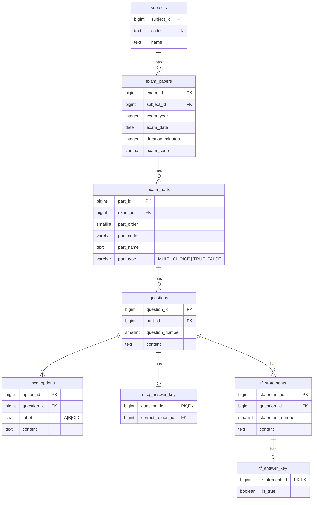

## Thiết kế CSDL hệ thống quản lý đề thi trắc nghiệm Tin học THPT Quốc gia

### 1) Mô tả ERD (bằng văn bản)
- **subjects**: Danh mục môn học (mở rộng được ngoài Tin học).
  - Quan hệ: `subjects 1 — n exam_papers`.
- **exam_papers**: Một đề thi cụ thể (biến thể mã đề) của một môn, một năm, có ngày thi và thời lượng.
  - Thuộc tính: năm thi, ngày thi, thời lượng, mã đề (ví dụ 101, 102…), ràng buộc duy nhất trong phạm vi (môn, năm).
  - Quan hệ: `exam_papers 1 — n exam_parts`.
- **exam_parts**: Các phần của một đề (ví dụ: Phần I, Phần II) với loại phần: MULTI_CHOICE hoặc TRUE_FALSE.
  - Thuộc tính: mã phần, tên phần, thứ tự phần, loại phần.
  - Quan hệ: `exam_parts 1 — n questions`.
- **questions**: Câu hỏi thuộc một phần cụ thể, có số thứ tự trong phần và nội dung.
  - Thuộc tính: số thứ tự câu, nội dung câu hỏi.
  - Quan hệ phân nhánh theo loại phần:
    - Nếu phần là MULTI_CHOICE: `questions 1 — n mcq_options`; `questions 1 — 1 mcq_answer_key` (đáp án đúng).
    - Nếu phần là TRUE_FALSE: `questions 1 — n tf_statements`; `tf_statements 1 — 1 tf_answer_key` (đúng/sai cho từng ý).
- **mcq_options**: 4 phương án A/B/C/D cho câu MULTI_CHOICE (ràng buộc nhãn A–D và duy nhất theo câu).
- **mcq_answer_key**: Khoá đáp án đúng cho câu MULTI_CHOICE, tham chiếu đúng về `mcq_options` của chính câu đó (không trộn đáp án bên trong bảng câu hỏi).
- **tf_statements**: 4 ý nhỏ (Ý 1..4) cho câu TRUE_FALSE, duy nhất số ý trong phạm vi câu.
- **tf_answer_key**: Khoá đúng/sai cho từng ý của câu TRUE_FALSE (không trộn vào bảng câu hỏi).

Ràng buộc và tối ưu:
- Khóa chính dạng số định danh (identity) cho tất cả bảng lõi.
- Khóa ngoài có `ON DELETE CASCADE` cho bảng con để dọn dẹp dữ liệu nhất quán khi xoá đề/phần/câu.
- Duy nhất: `(subject_id, exam_year, exam_code)`, `(exam_id, part_order)`, `(exam_id, part_code)`, `(part_id, question_number)`, `(question_id, label)` (A–D), `(question_id, statement_number)`.
- Ràng buộc kiểm tra (CHECK): giới hạn giá trị hợp lệ cho năm, thời lượng, nhãn A–D, loại phần, số thứ tự.
- Đáp án nằm ở các bảng riêng: `mcq_answer_key` và `tf_answer_key`.
- Mở rộng: có thể thêm môn mới vào `subjects`, thêm năm/mã đề/phần/câu không cần đổi lược đồ.

### 2) Sơ đồ ERD (Mermaid)


### 3) Lệnh SQL tạo bảng (PostgreSQL)
```sql
-- Schema: THPTQG IT Exam (PostgreSQL dialect)
-- Gợi ý: chạy trong một transaction để tạo đồng bộ
BEGIN;

CREATE TABLE IF NOT EXISTS subjects (
    subject_id       BIGINT GENERATED ALWAYS AS IDENTITY PRIMARY KEY,
    code             TEXT    NOT NULL UNIQUE,      -- ví dụ: "TIN", "TOAN"
    name             TEXT    NOT NULL
);

CREATE TABLE IF NOT EXISTS exam_papers (
    exam_id          BIGINT GENERATED ALWAYS AS IDENTITY PRIMARY KEY,
    subject_id       BIGINT  NOT NULL REFERENCES subjects(subject_id)
                                 ON UPDATE CASCADE ON DELETE RESTRICT,
    exam_year        INTEGER NOT NULL CHECK (exam_year BETWEEN 2000 AND 2100),
    exam_date        DATE    NOT NULL,
    duration_minutes INTEGER NOT NULL CHECK (duration_minutes BETWEEN 1 AND 300),
    exam_code        VARCHAR(20) NOT NULL,
    CONSTRAINT uq_exam_per_subject_year_code
        UNIQUE (subject_id, exam_year, exam_code)
);

CREATE TABLE IF NOT EXISTS exam_parts (
    part_id     BIGINT GENERATED ALWAYS AS IDENTITY PRIMARY KEY,
    exam_id     BIGINT     NOT NULL REFERENCES exam_papers(exam_id)
                               ON UPDATE CASCADE ON DELETE CASCADE,
    part_order  SMALLINT   NOT NULL CHECK (part_order >= 1),
    part_code   VARCHAR(20) NOT NULL,        -- ví dụ: "P1", "P2"
    part_name   TEXT       NOT NULL,         -- ví dụ: "Phần I", "Phần II"
    part_type   VARCHAR(20) NOT NULL CHECK (part_type IN ('MULTI_CHOICE','TRUE_FALSE')),
    CONSTRAINT uq_part_order_per_exam UNIQUE (exam_id, part_order),
    CONSTRAINT uq_part_code_per_exam  UNIQUE (exam_id, part_code)
);

CREATE TABLE IF NOT EXISTS questions (
    question_id      BIGINT GENERATED ALWAYS AS IDENTITY PRIMARY KEY,
    part_id          BIGINT    NOT NULL REFERENCES exam_parts(part_id)
                                   ON UPDATE CASCADE ON DELETE CASCADE,
    question_number  SMALLINT  NOT NULL CHECK (question_number >= 1),
    content          TEXT      NOT NULL,
    CONSTRAINT uq_question_number_per_part UNIQUE (part_id, question_number)
);

-- Phần I: Trắc nghiệm nhiều lựa chọn (A/B/C/D)
CREATE TABLE IF NOT EXISTS mcq_options (
    option_id    BIGINT GENERATED ALWAYS AS IDENTITY PRIMARY KEY,
    question_id  BIGINT   NOT NULL REFERENCES questions(question_id)
                               ON UPDATE CASCADE ON DELETE CASCADE,
    label        CHAR(1)  NOT NULL CHECK (label IN ('A','B','C','D')),
    content      TEXT     NOT NULL,
    CONSTRAINT uq_label_per_question UNIQUE (question_id, label),
    -- Tạo unique pair để phục vụ FK kép từ mcq_answer_key
    CONSTRAINT uq_option_per_question UNIQUE (question_id, option_id)
);

CREATE TABLE IF NOT EXISTS mcq_answer_key (
    question_id        BIGINT  NOT NULL PRIMARY KEY REFERENCES questions(question_id)
                                          ON UPDATE CASCADE ON DELETE CASCADE,
    correct_option_id  BIGINT  NOT NULL,
    -- Đảm bảo option đúng thuộc về chính question_id này
    CONSTRAINT fk_correct_pair FOREIGN KEY (question_id, correct_option_id)
        REFERENCES mcq_options (question_id, option_id)
        ON UPDATE CASCADE ON DELETE CASCADE
);

-- Phần II: Trắc nghiệm Đúng/Sai gồm 4 ý nhỏ
CREATE TABLE IF NOT EXISTS tf_statements (
    statement_id      BIGINT GENERATED ALWAYS AS IDENTITY PRIMARY KEY,
    question_id       BIGINT    NOT NULL REFERENCES questions(question_id)
                                   ON UPDATE CASCADE ON DELETE CASCADE,
    statement_number  SMALLINT  NOT NULL CHECK (statement_number BETWEEN 1 AND 4),
    content           TEXT      NOT NULL,
    CONSTRAINT uq_statement_number_per_question UNIQUE (question_id, statement_number)
);

CREATE TABLE IF NOT EXISTS tf_answer_key (
    statement_id  BIGINT   NOT NULL PRIMARY KEY REFERENCES tf_statements(statement_id)
                                     ON UPDATE CASCADE ON DELETE CASCADE,
    is_true       BOOLEAN  NOT NULL
);

-- Chỉ mục hỗ trợ truy vấn (tối ưu phổ biến)
CREATE INDEX IF NOT EXISTS idx_exam_parts_exam ON exam_parts(exam_id);
CREATE INDEX IF NOT EXISTS idx_questions_part ON questions(part_id);
CREATE INDEX IF NOT EXISTS idx_mcq_options_question ON mcq_options(question_id);
CREATE INDEX IF NOT EXISTS idx_tf_statements_question ON tf_statements(question_id);

COMMIT;
```

### 4) Ghi chú thiết kế và vận hành
- **Tính mở rộng**: thêm môn mới vào `subjects`, thêm đề mới (năm, mã đề) vào `exam_papers`, thêm phần/câu/ý nhỏ không cần thay đổi lược đồ.
- **Toàn vẹn tham chiếu**: dùng `ON DELETE CASCADE` cho bảng con để không sinh dữ liệu mồ côi khi xoá đề, phần, câu.
- **Tách đáp án**: đáp án luôn nằm ở `mcq_answer_key` và `tf_answer_key`, không trộn trong `questions`, `mcq_options`, `tf_statements`.
- **Ràng buộc loại phần**: ứng dụng nên đảm bảo chỉ tạo `mcq_options` cho phần `MULTI_CHOICE` và chỉ tạo `tf_statements` cho phần `TRUE_FALSE`. Nếu cần cưỡng bức ở DB, có thể thêm trigger kiểm tra `exam_parts.part_type` theo `questions.part_id`.
- **Kiểm thử dữ liệu**: nên thêm kiểm tra ở tầng ứng dụng để bảo đảm mỗi câu MULTI_CHOICE có đúng 4 phương án A–D và mỗi câu TRUE_FALSE có đúng 4 ý.
